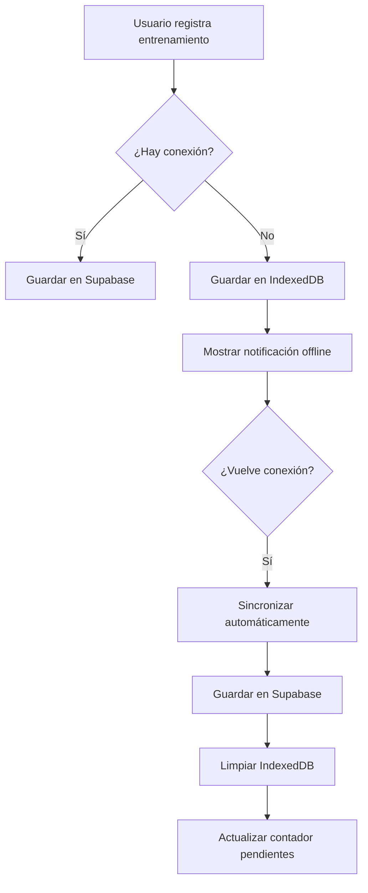

# 📱 PWA - Modo Offline

## ✨ Características

Gold's Gains ahora es una **Progressive Web App (PWA)** con soporte completo para modo offline.

### Funcionalidades Implementadas

✅ **Instalable**: Puedes instalar la app en tu dispositivo móvil o escritorio  
✅ **Modo Offline**: Registra tus entrenamientos sin conexión a internet  
✅ **Sincronización Automática**: Los datos se sincronizan automáticamente cuando vuelve la conexión  
✅ **Almacenamiento Local**: IndexedDB guarda tus registros pendientes de forma segura  
✅ **Indicadores Visuales**: Ve el estado de conexión y registros pendientes en tiempo real

---

## 🚀 Cómo Funciona

### 1. **Registro Offline**

Cuando no tienes conexión a internet:

- 📴 Aparece un indicador "Modo Offline" en la esquina superior derecha
- Al registrar un entrenamiento, se guarda localmente en **IndexedDB**
- Recibes una notificación: "📴 Guardado offline. Se sincronizará automáticamente cuando haya conexión."

### 2. **Sincronización Automática**

Cuando vuelves a tener conexión:

- 🔄 La app detecta automáticamente que hay internet
- Los registros pendientes se sincronizan con la base de datos
- Recibes una notificación: "✅ X registro(s) sincronizado(s)"
- El contador de pendientes se actualiza

### 3. **Indicadores Visuales**

#### Estado Offline

```
🟠 Modo Offline
```

#### Registros Pendientes

```
🔄 X pendiente(s)
```

---

## 📦 Instalación como PWA

### En Móvil (Android/iOS)

1. Abre la app en tu navegador (Chrome, Safari, etc.)
2. Busca la opción **"Agregar a pantalla de inicio"** o **"Instalar aplicación"**
3. Confirma la instalación
4. ¡Listo! Ahora puedes usar la app como una aplicación nativa

### En Escritorio (Chrome/Edge)

1. Abre la app en tu navegador
2. Haz clic en el ícono ➕ en la barra de direcciones
3. Selecciona **"Instalar"**
4. La app se instalará como aplicación de escritorio

---

## 🔧 Arquitectura Técnica

### Service Worker (`/public/sw.js`)

- Cachea archivos estáticos (páginas, imágenes, logo)
- Intercepts peticiones de red
- Gestiona sincronización en background
- Estrategia: **Network First, fallback to Cache**

### IndexedDB (`/src/lib/offlineDB.ts`)

- Base de datos local del navegador
- Almacena workouts pendientes de sincronizar
- Persistente (no se borra al cerrar el navegador)

### Componente PWA (`/src/app/components/PWARegister.tsx`)

- Registra el Service Worker
- Escucha eventos de conexión/desconexión
- Dispara sincronización automática

### Manifest (`/public/manifest.json`)

- Metadata de la PWA
- Íconos, colores, nombre de la app
- Configuración de instalación

---

## 📊 Flujo de Datos



---

## 🛠️ Desarrollo

### Archivos Principales

```
golds-gains/
├── public/
│   ├── sw.js              # Service Worker
│   ├── manifest.json      # PWA Manifest
│   └── logo.png           # Ícono de la app
├── src/
│   ├── app/
│   │   ├── layout.tsx     # Metadata PWA
│   │   ├── components/
│   │   │   └── PWARegister.tsx  # Registro SW
│   │   └── progress/
│   │       └── page.tsx   # Lógica offline integrada
│   └── lib/
│       └── offlineDB.ts   # Funciones IndexedDB
└── next.config.ts         # Configuración PWA
```

### Scripts de IndexedDB

```typescript
// Guardar workout offline
await saveOfflineWorkout(workoutData);

// Obtener workouts pendientes
const pending = await getPendingWorkouts();

// Marcar como sincronizado
await markAsSynced(id);

// Eliminar sincronizados
await deleteSyncedWorkout(id);

// Contar pendientes
const count = await getPendingCount();
```

---

## ⚠️ Consideraciones

### Limitaciones

- ⚠️ Solo funciona en **HTTPS** o **localhost**
- ⚠️ IndexedDB tiene límites de almacenamiento (varía por navegador)
- ⚠️ Los datos offline solo están en el dispositivo local

### Recomendaciones

- 📱 Instala la app para mejor experiencia
- 🔄 Sincroniza regularmente cuando tengas conexión
- 💾 No borres el caché del navegador si tienes datos pendientes

---

## 🧪 Testing

### Probar Modo Offline en Chrome DevTools

1. Abre Chrome DevTools (F12)
2. Ve a la pestaña **Network**
3. Cambia "Online" a **"Offline"**
4. Registra un entrenamiento
5. Verifica que se guarda en IndexedDB (pestaña **Application > IndexedDB**)
6. Cambia de vuelta a "Online"
7. Verifica que se sincroniza automáticamente

---

## 📝 Notas

- Los registros offline se guardan con timestamp local
- La sincronización es automática pero también puedes forzarla recargando la página
- El logo de la app aparece en el favicon y como ícono de instalación
- La app funciona completamente offline después de la primera carga

---

## 🎯 Próximas Mejoras

- [ ] Botón manual de sincronización
- [ ] Ver detalles de registros pendientes
- [ ] Notificaciones push cuando se complete la sincronización
- [ ] Caché inteligente de datos del plan
- [ ] Exportar datos offline como backup

---

**¡Disfruta de Gold's Gains sin preocuparte por la conexión! 💪📴**
